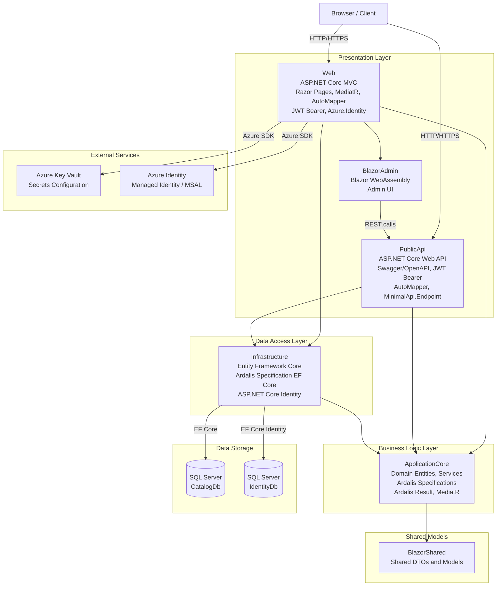

# Architecture Diagram

eShopOnWeb is an ASP.NET Core reference application implementing a layered architecture with a web storefront, a Blazor-based admin panel, and a REST API, all backed by SQL Server via Entity Framework Core.

## Application Architecture

